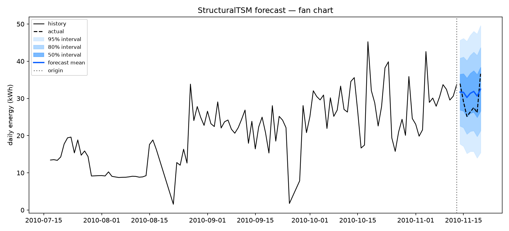
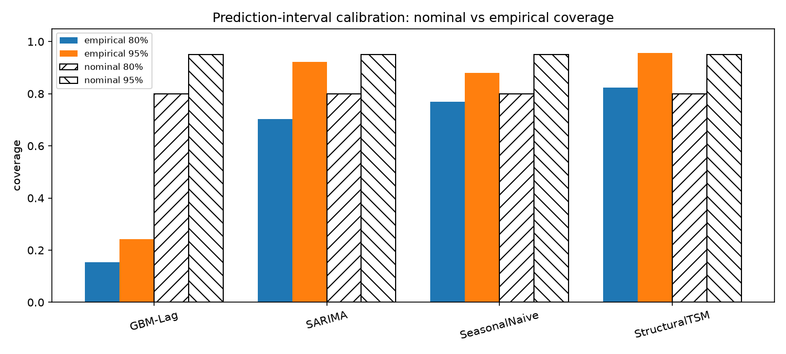

# Probabilistic Time-Series Forecasting

A from-scratch **structural time-series model** (local linear trend + weekly seasonality,
estimated by **maximum likelihood via the Kalman filter**) compared against ARIMA,
gradient boosting, and seasonal-naive baselines — evaluated the way forecasts should be:
on **probabilistic** skill (CRPS, prediction-interval calibration), not just point accuracy.

## Problem statement

A household's daily electricity consumption (1,442 days, 2006–2010, UCI ML Repository)
must be forecast 7 days ahead. Point forecasts are not enough: a grid operator needs to
know *how uncertain* the forecast is. The questions:

1. Can a structural state-space model with an analytically derived predictive distribution beat standard baselines?
2. Which model gives the best-**calibrated** uncertainty — honest 80%/95% prediction intervals?
3. Does the winner on point metrics also win on probabilistic metrics? (Spoiler: no.)

## Methodology

- **StructuralTSM (this repo's model).** State-space model
  $y_t = \mu_t + \gamma_t + \varepsilon_t$ with local linear trend and sum-to-zero
  weekly seasonality, implemented **from scratch**: Kalman filter recursions, RTS smoother,
  and MLE of the four variance parameters by prediction-error decomposition
  (L-BFGS-B, 3 restarts). Multi-step predictive variances propagated analytically.
  Full derivations in [`docs/math_notes.md`](docs/math_notes.md).
- **Baselines.** Seasonal ARIMA(2,1,2)×(1,1,1,7) (statsmodels), gradient boosting on
  lag/rolling features (`HistGradientBoostingRegressor`, recursive 7-step), seasonal naive.
  Every baseline also emits a predictive std so all models face the same probabilistic metrics.
- **Evaluation.** Rolling-origin backtest: 13 weekly origins over the last 98 days, 7-day
  horizon, models refit using *only* data up to each origin (no look-ahead).
  Metrics: MAE / RMSE / MAPE **and** CRPS (proper scoring rule, closed-form Gaussian),
  empirical coverage of 80%/95% intervals, mean interval width.

## Results

Averaged over 13 rolling origins (7-day horizon). All numbers computed by
`scripts/run_analysis.py` — see `results/metrics.json`.

| model | MAE ↓ | RMSE ↓ | CRPS ↓ | cov 80% (nom. 0.80) | cov 95% (nom. 0.95) | width 80% |
|---|---|---|---|---|---|---|
| **StructuralTSM** | 5.98 | 7.04 | **4.26** | **0.82** | **0.96** | 20.3 |
| GBM-Lag | **5.93** | 7.29 | 5.52 | 0.15 | 0.24 | 2.1 |
| SARIMA | 6.59 | 7.62 | 4.64 | 0.70 | 0.92 | 17.8 |
| SeasonalNaive | 8.72 | 10.56 | 6.37 | 0.77 | 0.88 | 25.6 |

**Reading the table (the honest story):**
- GBM-Lag wins on point accuracy (MAE 5.93 vs 5.98) but its uncertainty is
  **catastrophically overconfident**: its nominal 80% intervals contain the truth only
  15% of the time. A sharper-looking forecast that lies about its uncertainty.
- StructuralTSM wins on CRPS (4.26, best) and is the only **calibrated** model —
  empirical coverage 0.82/0.96 against nominal 0.80/0.95. Honest uncertainty beats
  slightly-better point forecasts.
- MLE on the full sample: $\sigma_\varepsilon^2=32.85$, $\sigma_{\text{level}}^2=4.34$,
  $\sigma_{\text{trend}}^2\approx0$ (deterministic trend selected by the data),
  $\sigma_{\text{seas}}^2=0.10$.




## Quick start

```bash
pip install -r requirements.txt
pip install -e .
python scripts/run_analysis.py   # reproduces results/metrics.json + results/figures/
pytest tests/ -q                 # 15 tests
```

## Project structure

```
probabilistic-time-series-forecasting/
├── src/tsforecast/
│   ├── data.py            # UCI download docs, daily aggregation, caching
│   ├── statespace.py      # Kalman filter, RTS smoother, MLE, forecasting
│   ├── baselines.py       # seasonal naive, SARIMA, GBM-lag, TSM wrapper
│   ├── evaluation.py      # CRPS, coverage, rolling-origin backtest
│   └── visualization.py   # fan chart, coverage plot, diagnostics
├── scripts/run_analysis.py
├── tests/                 # 15 tests incl. no-look-ahead + Kalman recovery
├── docs/math_notes.md     # Kalman/CRPS derivations
├── data/                  # raw (git-ignored) + processed daily_kwh.csv
└── results/               # metrics.json + figures (committed evidence)
```

## Reproducibility

Fixed seed (`SEED = 0`) everywhere, pinned dependencies (`requirements.txt`),
cached processed data (`data/processed/daily_kwh.csv` is committed; the 133 MB raw
file is git-ignored and re-downloadable from the documented URL).

## Limitations & future work

- MAPE is inflated (36–63%) because a few days have near-zero consumption
  (min 0.24 kWh); MAE/RMSE/CRPS are the reliable metrics here.
- GBM and seasonal-naive intervals assume homoscedastic Gaussian residuals —
  a crude choice, deliberately kept simple so the calibration failure is visible.
  Quantile-regression intervals would be the natural upgrade.
- statsmodels SARIMA hit convergence warnings on some origins (documented in the
  run log); results use the returned estimates regardless — an honest reflection
  of ARIMA's brittleness on this series.
- The Kalman model is univariate and linear-Gaussian; extensions: exogenous
  regressors (temperature), Student-t observation noise for robustness, or a
  fully Bayesian treatment (MCMC over variances) instead of MLE plug-in.
- Only one series and one horizon (7d) are evaluated; multi-series / multi-horizon
  would strengthen the conclusions.

## References

- UCI ML Repository — Individual household electric power consumption (Hebrail & Bérard).
- Durbin & Koopman (2012), *Time Series Analysis by State Space Methods*.
- Gneiting & Raftery (2007), Strictly proper scoring rules, prediction, and estimation, *JASA*.
- Hyndman & Athanasopoulos (2021), *Forecasting: Principles and Practice*, 3rd ed.
